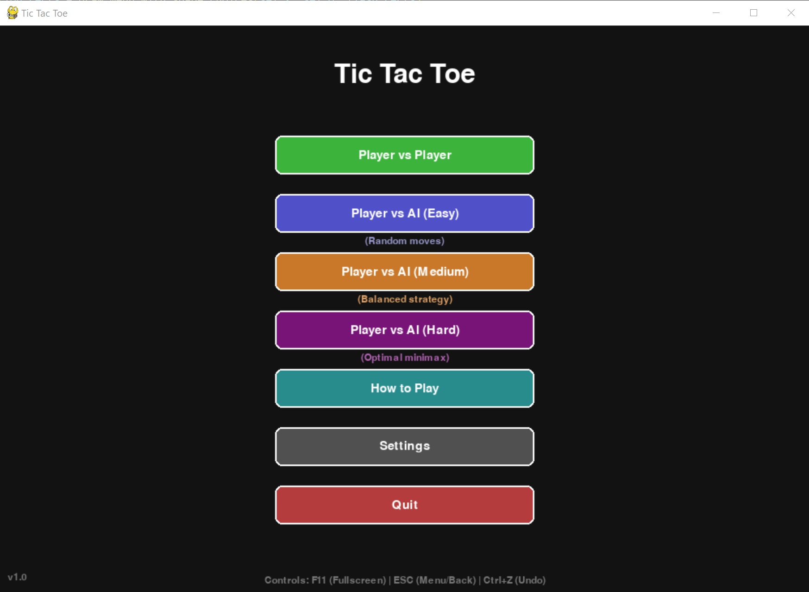
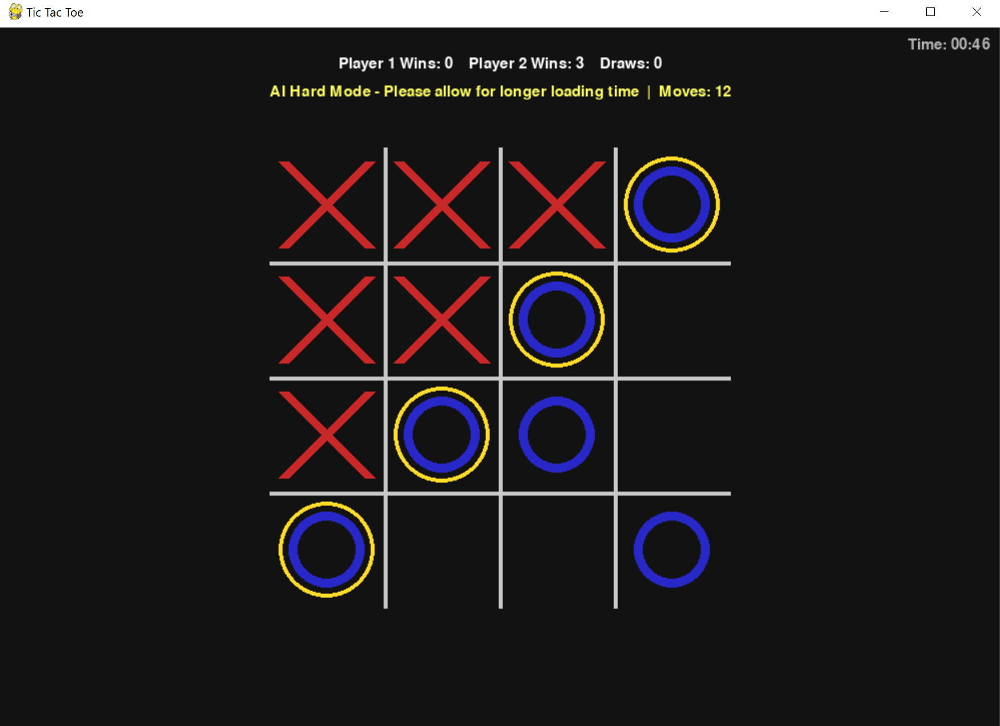
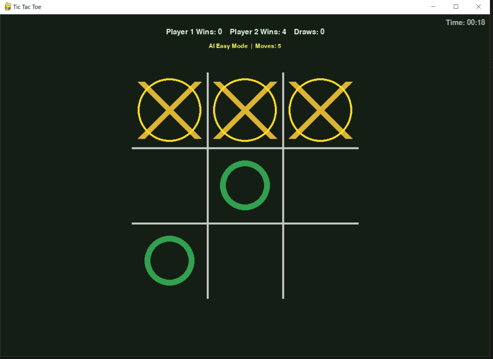
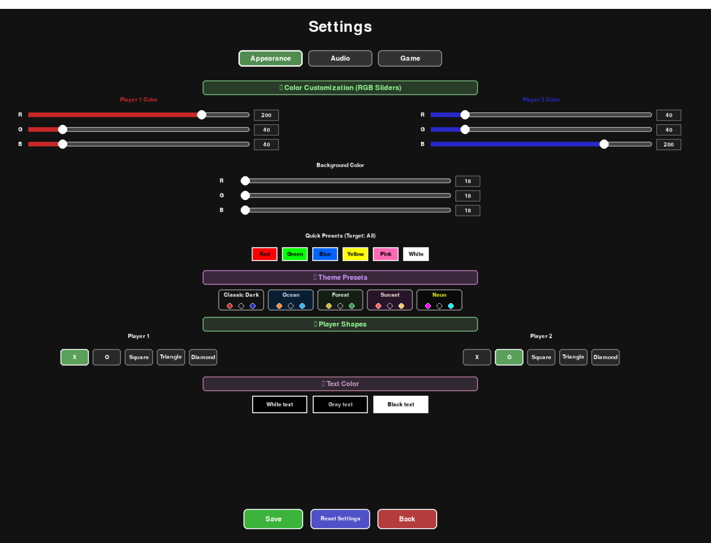

# tic-tac-toe-pygame
Tic-Tac-Toe in Python/Pygame 🎮

## Overview

This is a customized version of Tic-Tac-Toe built in Python with Pygame. Unlike a standard tutorial version, this project includes:

- A graphical interface with custom design elements
- Player vs Player and Player vs AI modes
- Three AI difficulty levels (Easy = random, Medium = smart/random blend, Hard = optimized Minimax with alpha-beta pruning)
- Two board sizes: Classic 3x3 and Connect 4-style 4x4
- Undo move system (Ctrl+Z or button) with move history tracking
- Smooth piece placement animations with visual effects
- Game timer and move counter display
- Five quick-apply color themes plus full RGB customization
- Scoreboard and replay system
- Sound effects with adjustable volume controls
- Player name and symbol customization (5 shape options)

The game is designed as part of my NCLab Python Capstone Project and demonstrates problem solving, design decisions, and original enhancements beyond the basics.

## Features

- 🖥️ **GUI Board** with colors and symbols
- 🎮 **Two Board Sizes:** Classic 3x3 or Connect 4-style 4x4
- 🤖 **AI Opponent:** choose Easy, Medium, or Hard mode
  - Easy: Random moves
  - Medium: 60% smart moves, 40% random (balanced challenge)
  - Hard: Optimized Minimax with alpha-beta pruning and depth limiting
- ↩️ **Undo System:** Press Ctrl+Z or click the Undo button to take back your last move
- ✨ **Smooth Animations:** Watch pieces scale up smoothly as they're placed
- ⏱️ **Game Timer & Move Counter:** Track your game duration and move count
- 🎨 **Theming System:**
  - Five quick-apply themes (Classic Dark, Ocean, Forest, Sunset, Neon)
  - Full RGB customization for Player 1 color, Player 2 color, and background
  - 5 different shape options for each player (X, O, Square, Triangle, Diamond)
- 🎵 **Sound Effects** with adjustable volume controls for music and effects
- 🏆 **Scoreboard** to track wins, losses, draws
- 🔄 **Replay Option** without restarting
- ✨ **Visual feedback:** Winning line highlight, pulsing effects, hover states

## Installation Requirements

- Python 3.9+
- Pygame library

## Setup

1. Clone this repository:

```bash
git clone https://github.com/Jason-Epley/tic-tac-toe-pygame.git
cd tic-tac-toe-pygame
```

2. Install pygame:

```bash
pip install pygame
```

3. Run the game:

```bash
python TicTacToe_Python_Capstone_Project_1.py
```

## How to Play

1. Launch the game.

2. Choose your game mode from the main menu:
   - Player vs Player (local multiplayer)
   - Player vs AI Easy (random moves)
   - Player vs AI Medium (balanced difficulty)
   - Player vs AI Hard (challenging minimax AI)
   - How to Play (view instructions)
   - Settings (customize colors, sounds, board size, shapes)

3. In Settings, you can:
   - Toggle between Classic 3x3 and Connect 4-style 4x4 boards
   - Apply quick themes or customize RGB colors
   - Adjust sound effects and music volume
   - Choose player shapes (X, O, Square, Triangle, Diamond)

4. During gameplay:
   - Click an empty square to make your move
   - Press Ctrl+Z or click the Undo button to take back your last move
   - Watch the timer and move counter at the top
   - First to 3 in a row (or 4 in a row on 4x4 board) wins

5. After a game ends, you can play again or return to the main menu.

## Screenshots

### Main Menu


### Gameplay


### Gameplay 2


### Settings Screen


## Project Structure

```
tic-tac-toe-pygame/
├── TicTacToe_Python_Capstone_Project_1.py    # Main game file
├── TicTacToe_Python_Capstone_Project_1.spec  # PyInstaller spec file
├── game_utils.py                              # Utility functions
├── build.ps1                                  # PowerShell build script
├── requirements.txt                           # Python dependencies
├── settings.json                              # Saved game settings
├── assets/
│   ├── images/                                # Screenshots
│   └── sounds/                                # Audio files (BGM, SFX)
└── README.md                                  # Documentation
```

## Key Implemented Features

- ✅ Support for 3x3 and 4x4 board sizes
- ✅ Theming system with 5 pre-made themes and RGB customization
- ✅ Three AI difficulty levels with optimized algorithms
- ✅ Undo move system with visual feedback
- ✅ Smooth animations and visual effects
- ✅ Game timer and statistics tracking
- ✅ Comprehensive settings persistence
- ✅ 5 player shape options
- ✅ Fullscreen mode support (F11)
- ✅ Keyboard shortcuts and tooltips
- ✅ Confirmation dialogs for destructive actions
- ✅ "How to Play" instructions screen

## Credits

Developed by Jason Epley as part of NCLab Python Capstone

Built with Python + Pygame

## Development Roadmap for Tic-Tac-Toe (Pygame)

### Phase 1 – Setup & Core Game

- ✅ Install Python 3.9+ and Pygame.
- ✅ Create GitHub repo + set up main.py (skeleton we wrote).
- ✅ Draw board lines using Pygame.
- ✅ Allow players to place X and O on clicks.
- ✅ Alternate turns (done in skeleton).
- ✅ Add win detection logic (check rows, columns, diagonals).
- ✅ Display game over message (temporary text in console or on screen).

### Phase 2 – Polish Base Game

- ✅ Reset board when a game ends (new round without restarting).
- ✅ Add a scoreboard to track wins, losses, draws.
- ✅ Create a simple menu screen:
  - Choose Player vs Player or Player vs AI.
  - Choose player names/symbols.

### Phase 3 – AI Opponent

- ✅ Implement Easy AI (random move).
- ✅ Implement Medium AI (60% smart, 40% random for balanced challenge).
- ✅ Implement Hard AI (Minimax algorithm with alpha-beta pruning and depth limiting).
- ✅ Add option in menu to pick Easy/Medium/Hard AI.

### Phase 4 – User Experience Enhancements

- ✅ Add colors/graphics customization (5 shape options, 5 themes, full RGB control).
- ✅ Highlight the winning line when someone wins with pulsing animation.
- ✅ Add sound effects (move, AI move, win, lose, draw, menu sounds) with volume controls.
- ✅ Smooth animations (scale-up piece placement, visual effects).
- ✅ Add undo move system (Ctrl+Z and button).
- ✅ Add game timer and move counter display.

### Phase 5 – Final Touches

- ✅ Add replay button (instead of restart).
- ✅ Update README.md with screenshots and instructions.
- Record presentation demo.
- Push final version to GitHub with tags/releases.

## Music Credits

- **Background Music** `bgm.ogg` = chill background music #2.wav by ZHRØ -- [Freesound](https://freesound.org/s/703713/) -- License: Attribution 4.0
- **Menu click** `menu_select.wav` = Click - Wooden 2 by GameAudio -- [Freesound](https://freesound.org/s/220196/) -- License: Creative Commons 0
- **Lose sound** `lose.wav` = Jingle_Lose_01.wav by LittleRobotSoundFactory -- [Freesound](https://freesound.org/s/270334/) -- License: Attribution 4.0
- **Draw sound** `draw.wav` = Retro You Lose SFX by suntemple -- [Freesound](https://freesound.org/s/253174/) -- License: Creative Commons 0
- **Win sound** `win.wav` = Electro success sound by Unlistenable -- [Freesound](https://freesound.org/s/391540/) -- License: Attribution NonCommercial 4.0
- **AI move sound** `move_ai.wav` = Electro success sound by Unlistenable -- [Freesound](https://freesound.org/s/391540/) -- License: Attribution NonCommercial 4.0
- **Move sound** `move.wav` = Click_1.wav by JonnyRuss01 -- [Freesound](https://freesound.org/s/478197/) -- License: Creative Commons 0

## Build & Packaging

If you want to distribute the game to other users (Windows EXE), PyInstaller is the simplest option. The repository includes a spec file (`TicTacToe_Python_Capstone_Project_1.spec`) that bundles the `assets/` folder so sounds and other resources are available at runtime.

### Recommended steps (Windows PowerShell):

1. Install PyInstaller:

```powershell
pip install pyinstaller
```

2. Build a one-folder distribution (recommended for apps with many assets):

```powershell
# From the repo root
pyinstaller --noconfirm --onedir --add-data "assets;assets" TicTacToe_Python_Capstone_Project_1.py
```

This creates `dist\TicTacToe_Python_Capstone_Project_1\` containing the executable and an `assets/` directory. Users can run the EXE directly from that folder.

3. Or build using the provided spec file (it already includes the assets tree):

```powershell
pyinstaller TicTacToe_Python_Capstone_Project_1.spec
```

### Notes & Tips

- The app includes a `resource_path()` helper so asset lookup works when running from source, `--onedir` builds, or `--onefile` bundles (PyInstaller extracts files to a temp folder). If you change asset layout, update `resource_path` usage accordingly.
- For best portability, ship `bgm.ogg` (OGG is broadly supported). MP3 support depends on SDL_mixer build on some platforms.
- Single-file builds (`--onefile`) are possible but will extract assets to a temp folder at runtime and can increase startup time. Use `--onedir` for simpler distribution.
- To produce an installer (optional), package the `dist\TicTacToe_Python_Capstone_Project_1` folder with an installer builder (Inno Setup, NSIS) or zip it for users.

### Build Helper Script

The repository includes a `build.ps1` PowerShell script that automates the build process and creates a timestamped ZIP file:

```powershell
.\build.ps1
```

### Verification

After building, verify the distribution on a clean machine or VM to ensure assets (sounds) and music codecs load correctly.

**Minimal manual test checklist:**

- Unzip or copy the contents of the build folder (from `dist/`) to the test machine.
- Run the executable inside the folder (Windows: the .exe in the folder). The game should open a window.
- Go to Settings and confirm:
  - The RGB sliders are visible and draggable.
  - "Sound Effects Volume" and "Music Volume" sliders are present and audible (if your machine has audio output).
  - If music doesn't start, the top-right of Settings will show a small notice indicating bgm is missing or unavailable.
- Start a game and ensure move sounds and win/draw/lose sounds play when appropriate.

## Headless CI / Running Tests in CI *(Optional - For Future Development)*

When running automated tests or importing the module in headless CI runners, Pygame may fail to create a display/renderer. To run Pygame in headless mode set the SDL_VIDEODRIVER environment variable to "dummy" before importing or running Pygame code. Example (GitHub Actions):

```yaml
- name: Run tests (headless)
  env:
    SDL_VIDEODRIVER: dummy
  run: |
    python -m pip install -r requirements.txt
    python -m pytest -q
```

This tells SDL to use a dummy video driver so Pygame won't attempt to open an actual window. Use this in CI steps that only need to import the game or run unit tests that don't require a visible UI.
